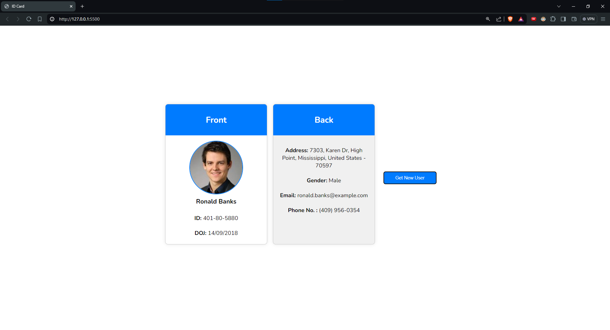

# Random User API

This repository contains code for learning about asynchronous JavaScript.

## Description

The project demonstrates the use of asynchronous JavaScript, specifically using the `fetch` API to retrieve data from an external API (`https://randomuser.me/api/`). The data is then used to dynamically create and display user ID cards.

## Features

- Fetches random user data from an API
- Formats and displays user information on ID cards
- Demonstrates asynchronous JavaScript and DOM manipulation

## Screenshots

- Initial Look:
  

- Button addEventListener 'click' :
  

## Contributing

If you encounter any issues or have suggestions for improvements, feel free to open an issue or submit a pull request on the GitHub repository.

This README provides a basic overview of fetching random user api. If you have any further questions or need assistance, don't hesitate to ask!
